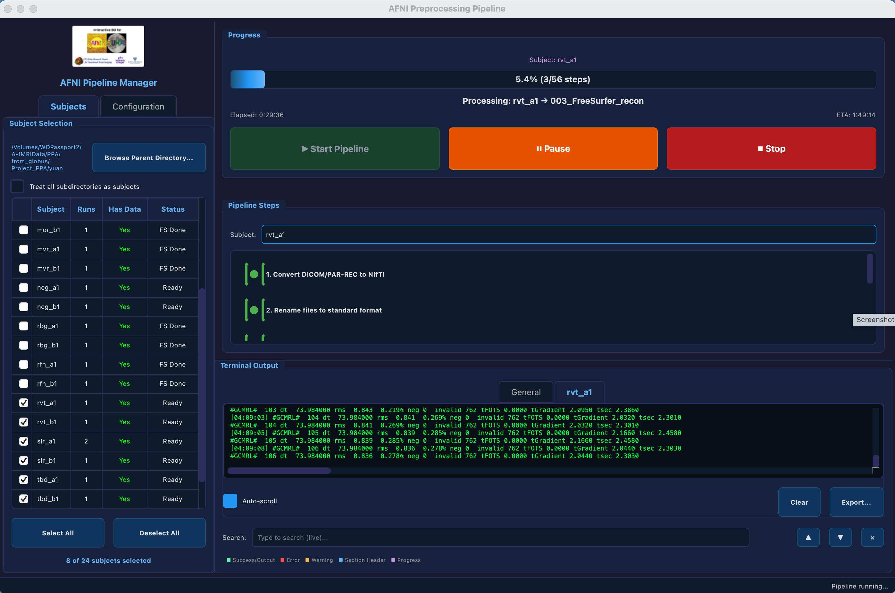
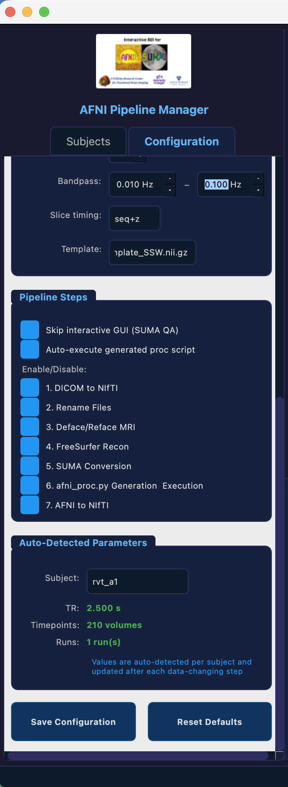
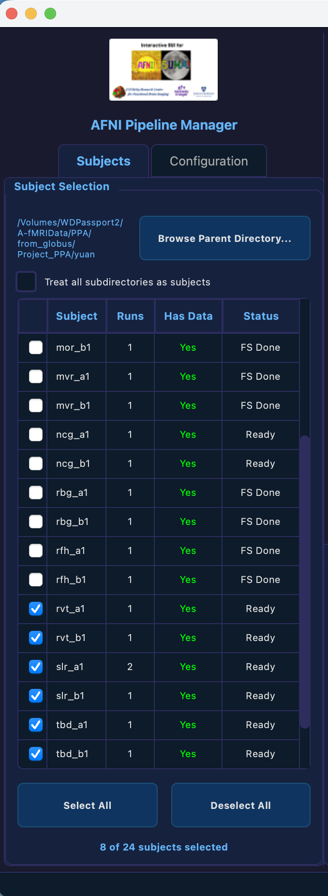

# AFNI Preprocessing Pipeline Manager

[](https://github.com/ismailukman/afni_preprocessing_pipeline/releases)
[]()
[]()
[](LICENSE)

A GUI and CLI-driven batch preprocessing framework for fMRI data using [AFNI](https://afni.nimh.nih.gov/), FreeSurfer, and dcm2niix.


---

## Table of Contents

- [Download](#download)
- [Prerequisites](#prerequisites)
- [Installation](#installation)
- [Launching the GUI](#launching-the-gui)
- [GUI Overview](#gui-overview)
  - [Subjects Panel](#subjects-panel)
  - [Configuration Panel](#configuration-panel)
  - [Pipeline Steps Panel](#pipeline-steps-panel)
  - [Terminal Output Panel](#terminal-output-panel)
  - [Progress Panel](#progress-panel)
- [Pipeline Steps](#pipeline-steps)
- [Pipeline Behavior](#pipeline-behavior)
- [Terminal Color Legend](#terminal-color-legend)
- [CLI Usage](#cli-usage)
- [Data Directory Structure](#data-directory-structure)
- [Acknowledgments](#acknowledgments)
- [Building from Source](#building-from-source)
- [What's New in v2.0.4](#whats-new-in-v204)
- [License](#license)

---

## Download

Pre-built installers are available on the [Releases](https://github.com/ismailukman/afni_preprocessing_pipeline/releases) page:

| Platform | File | Notes |
|----------|------|-------|
| **macOS** | `AFNI-Pipeline-Manager-v2.0.4-macOS.dmg` | Drag to Applications |
| **Windows** | `AFNI-Pipeline-Manager-v2.0.4-Windows.zip` | Extract and run `AFNI Pipeline Manager.exe` |
| **Linux** | `AFNI-Pipeline-Manager-v2.0.4-Linux.tar.gz` | Extract and run `./AFNI Pipeline Manager/AFNI Pipeline Manager` |

The installers bundle Python and PyQt6 — no Python installation needed. You still need **AFNI**, **FreeSurfer**, and **dcm2niix** on your system PATH.

---

## Prerequisites

These external neuroimaging tools must be installed separately:

- **[AFNI](https://afni.nimh.nih.gov/)** (3dinfo, afni_proc.py, @afni_refacer_run, etc.) — must be on `$PATH`
- **[FreeSurfer 7.x](https://surfer.nmr.mgh.harvard.edu/)** — recon-all, SUMA
- **[dcm2niix](https://github.com/rordenlab/dcm2niix)** — for DICOM/PAR-REC to NIfTI conversion

For running from source (instead of the installer), you also need:
- **Python 3.9+**
- **PyQt6 >= 6.6.0**

## Installation (from source)

```bash
git clone https://github.com/ismailukman/afni_preprocessing_pipeline.git
cd afni_preprocessing_pipeline
pip install -r gui_app/requirements.txt
```

## Launching the GUI

```bash
python3 gui_app/main.py
```

A splash screen appears while the application loads. Only one instance can run at a time — a lock file prevents duplicate launches.

---

## GUI Overview

The application window is split into a **left panel** (Subjects + Configuration tabs) and a **right panel** (Progress, Pipeline Steps, and Terminal Output).

<p align="center">
  
</p>

<p align="center">
  &nbsp;&nbsp;&nbsp;
  
</p>

### Subjects Panel

1. **Browse** or type a parent directory path containing subject folders.
2. The app **auto-scans** the directory for valid subject folders (those containing DICOM, PAR/REC, or NIfTI files, or a `PreprocessedData/` subdirectory).
3. Each discovered subject is listed in a table showing:
   - **Checkbox** — select/deselect for processing
   - **Subject ID** — folder name
   - **Runs** — auto-detected number of functional runs
   - **Data** — whether raw data files are present
   - **Status** — current processing state:
     - **Ready** — no preprocessing output detected; subject is ready to be processed
     - **FS Done** — FreeSurfer `recon-all` completed (detected via `brainmask.mgz`), but later AFNI steps haven't run yet
     - **Processed** — full pipeline completed (detected via `errts.*` files in the output directory)
4. Use **Select All** / **Deselect All** buttons for quick selection.
5. Run counts are auto-estimated from:
   - Renamed functional files in `PreprocessedData/` (highest priority)
   - Raw PAR/REC file pairs (each pair = 1 scan; subtracts 1 for structural)
   - Nested DICOM directories (XNAT-style `SCANS/` structure)

### Configuration Panel

Accessed via the **Configuration** tab on the left panel.

**Execution Mode:**

- **Auto-run all steps** — runs the full pipeline without pausing
- **Step-by-step** — pauses after each step for user confirmation
- **Semi-auto** — only pauses on errors

**Error Handling:**

- **Stop pipeline on error** — halts everything immediately
- **Skip subject on error** — marks remaining steps as skipped and continues to the next subject (default). Since the pipeline steps are sequential, a failure in any step prevents subsequent steps from running for that subject.

**FreeSurfer:** Set the path to your FreeSurfer installation (e.g., `/Applications/freesurfer/7.1.1`).

**Processing Parameters:**

| Parameter         | Default                         | Description                        |
| ----------------- | ------------------------------- | ---------------------------------- |
| Motion threshold  | 0.4 mm                          | Maximum allowed motion per TR      |
| Outlier threshold | 0.1                             | Fraction of outlier voxels allowed |
| Blur size (FWHM)  | 6 mm                            | Spatial smoothing kernel           |
| Polynomial order  | 2                               | Baseline trend removal order       |
| Bandpass          | 0.01–0.1 Hz                    | Temporal frequency filter          |
| Slice timing      | seq+z                           | Slice acquisition pattern          |
| Template          | MNI152_2009_template_SSW.nii.gz | Standard space template            |

**Pipeline Steps:** Enable or disable individual steps using checkboxes. Disabled steps are skipped for all subjects.

**Auto-Detected Parameters:** Displays per-subject detected TR, timepoints, and number of runs. A **Subject dropdown** lets you switch between subjects to review their detected values. Parameters are automatically re-detected after each data-changing step (DICOM conversion, file renaming, defacing).

### Pipeline Steps Panel

Shows the 7 pipeline steps with colored status indicators:

- **Gray ●** — Pending (not yet started)
- **Blue ●** — Running (with animated progress bar)
- **Green ●** — Completed successfully
- **Red ●** — Error (step failed)
- **Yellow ●** — Skipped

A **Subject dropdown** at the top lets you switch between subjects to see each one's individual step history. The view auto-switches when:

- A new subject starts processing
- You click a different subject tab in the Terminal Output panel

### Terminal Output Panel

A real-time terminal-style log viewer with **per-subject tabs**. Each subject gets its own tab that records all output from every step.

**Features:**

- **Live search** — type to search with 200ms debounce; highlights all matches in yellow, current match in orange
- **Navigation** — ▲/▼ buttons to jump between matches
- **Auto-scroll** — toggle per tab
- **Export** — save a subject's log to a text file
- **Clear** — clear a tab's content

**Switching tabs automatically syncs** the Pipeline Steps panel and Auto-Detected Parameters to show that subject's data.

### Progress Panel

Shows overall pipeline progress:

- **Subject indicator** — currently processing subject and run
- **Progress bar** — percentage and step count (completed/total across all subjects)
- **Elapsed time** and **ETA** — real-time estimates
- **Controls:**
  - **▶ Start Pipeline** — begins processing all selected subjects (pulses while running)
  - **⏸ Pause / ▶ Resume** — pause/resume execution (pulses while paused)
  - **⏹ Stop** — stop with confirmation dialog

---

## Pipeline Steps

The pipeline consists of 7 sequential steps. Each step depends on the previous one completing successfully.

| # | Step              | Script                         | Description                                                                    |
| - | ----------------- | ------------------------------ | ------------------------------------------------------------------------------ |
| 1 | DICOM to NIfTI    | `001a_dcm2niix.csh`          | Convert DICOM/PAR-REC files to NIfTI format                                    |
| 2 | Rename Files      | `001c_rename_files.csh`      | Rename to standard naming format (`func_run1+orig.nii`, `struct+orig.nii`) |
| 3 | Deface/Reface MRI | `002_batch_defaceMRI.csh`    | Deface functional and reface structural images for anonymization               |
| 4 | FreeSurfer Recon  | `003_FreeSurfer_recon.csh`   | Run `recon-all` for cortical surface reconstruction                          |
| 5 | SUMA Conversion   | `003b_FreeSurferQA_SUMA.csh` | Convert FreeSurfer surfaces to SUMA format                                     |
| 6 | afni_proc.py      | `004_createAP_struct_rf.csh` | Generate and execute the AFNI preprocessing command                            |
| 7 | AFNI to NIfTI     | `005_afni2nifti.csh`         | Convert final AFNI output datasets to NIfTI                                    |

**Smart skipping:** Each step checks whether its output already exists and skips automatically if detected (e.g., if NIfTI files already exist, DICOM conversion is skipped).

---

## Pipeline Behavior

- **Sequential execution** — steps run in order. If step N fails, steps N+1 through 7 cannot run and are marked as skipped for that subject.
- **Per-subject tracking** — each subject maintains its own independent record of step statuses. Switching subjects in any panel (Pipeline Steps, Terminal Output, or Auto-Detected Parameters) shows that subject's specific state.
- **Auto-detection** — scan parameters (TR, timepoints per run, number of runs) are detected from functional NIfTI files and updated after every data-changing step.
- **Error logs** — each subject gets an error log file in its `PreprocessedData/` folder with timestamped error messages.
- **Batch processing** — subjects are processed one at a time in sequence. After one subject finishes (or fails and is skipped), the next subject begins automatically.

---

## Terminal Color Legend

The terminal output uses color coding to help identify message types at a glance:

| Color                                 | Meaning                 | Examples                                                   |
| ------------------------------------- | ----------------------- | ---------------------------------------------------------- |
| **Green** (`#69F0AE`)         | Success / normal output | `✓ Step completed successfully`, standard script output |
| **Red** (`#ff5252`)           | Error                   | `✗ Step failed`, error messages from scripts            |
| **Orange** (`#FFB74D`)        | Warning                 | Non-fatal warnings, cautionary messages                    |
| **Blue** (`#64b5f6`)          | Section header          | `========` and `--------` separator lines              |
| **Purple** (`#CE93D8`)        | Progress indicator      | Messages with progress counts like `[1/12]`              |
| **Default green** (`#00ff41`) | Standard output         | Regular command output                                     |

---

## CLI Usage

For command-line batch processing without the GUI:

1. Edit `subjects.csv` with subject details:
   ```csv
   subject_id,session,dcm_folder,num_runs,motion_threshold,skip_steps
   sub01,a1,/path/to/sub01_a1,1,0.4,
   sub02,b1,/path/to/sub02_b1,1,0.3,001a:001c
   ```
2. Edit `config.cfg` with paths and parameters.
3. Run: `tcsh run_pipeline.csh`

---

## Data Directory Structure

The application expects subject data organized as flat folders under a parent directory:

```
parent_directory/
├── subject1_session1/
│   ├── *.par / *.rec          (raw PAR/REC data)
│   └── PreprocessedData/      (created during processing)
│       ├── func_run1+orig.nii
│       ├── struct+orig.nii
│       └── subject1_session1/ (FreeSurfer output)
├── subject2_session1/
│   ├── DICOM/                 (raw DICOM data)
│   └── PreprocessedData/
└── ...
```

Each subject folder can contain:

- **PAR/REC** files (Philips format) at the top level
- **DICOM** files in subdirectories
- **Nested XNAT-style** structure (`SubjectName/SCANS/###/DICOM/`)
- A `PreprocessedData/` folder is created automatically during processing

---

## Acknowledgments

This tool automates preprocessing workflows built on [AFNI](https://afni.nimh.nih.gov/) (Analysis of Functional NeuroImages) and [SUMA](https://afni.nimh.nih.gov/). AFNI is developed and maintained by the Scientific and Statistical Computing Core at the National Institute of Mental Health (NIMH).

Special thanks to my Mentor **Ann S. Choe, Ph.D.** ([Johns Hopkins Medicine](https://profiles.hopkinsmedicine.org/provider/ann-choe/2777571)) and The Adaptive Brain Networks Neuroimaging Lab (ABN² Lab) for the support and also providing the original preprocessing scripts and pipeline design that this tool automates.

**Author:** **Lukman E. Ismaila, Ph.D.** — [ismailukman.github.io](https://ismailukman.github.io/)

---

<details>
<summary><strong>Building from Source</strong></summary>

To build the standalone installer yourself:

**macOS (.dmg):**
```bash
pip install pyinstaller
bash build_macos.sh
# Output: dist/AFNI-Pipeline-Manager-v2.0.4-macOS.dmg
```

**Windows (.exe):**
```cmd
pip install pyinstaller
build_windows.bat
# Output: dist\AFNI-Pipeline-Manager-v2.0.4-Windows.zip
```

**Linux (.tar.gz):**
```bash
pip install pyinstaller
bash build_linux.sh
# Output: dist/AFNI-Pipeline-Manager-v2.0.4-Linux.tar.gz
```

Automated builds are also triggered via GitHub Actions when a version tag is pushed (e.g., `git tag v2.0.4 && git push --tags`).

</details>

---

<details>
<summary><strong>What's New in v2.0.4</strong></summary>

- **Unified log file per subject** — Replaced separate `pipeline_log_*` and `error_log_*` with a single `log_<subject>_<timestamp>.txt` that captures all stdout and stderr. Log files are continuously appended on re-runs.
- **Full status summary in log** — Each subject's log now ends with a step-by-step summary showing done/failed/skipped status and per-step timing.
- **CSV progress tracking** — A `progress_summary.csv` file is created in the parent directory and updated in real time after each step, with columns for subject ID, step statuses, number of runs, TR, motion threshold, and total elapsed time.
- **Per-subject step selection (improved)** — Badge clicks in Pipeline Steps are now per-subject only and do not modify the global config. If all steps are unchecked for a subject, all steps run by default.
- **Backward-compatible log loading** — The terminal viewer loads legacy `pipeline_log_*`, `error_log_*`, and `output.proc.*` files from prior versions.

</details>

<details>
<summary><strong>Previous: v2.0.3</strong></summary>

- **Per-subject pipeline step selections** — Each subject can now have different steps enabled/disabled. Switch subjects in the Pipeline Steps dropdown to customize which steps run for each subject individually. Config panel checkboxes apply to all subjects at once.
- **Fixed start-from / selective step execution** — Checking only specific steps (e.g., steps 6-7) and clicking Start now correctly runs those steps instead of auto-skipping them. The auto-skip detection is bypassed for explicitly selected steps.
- **Checkbox synchronization** — Pipeline Steps panel and Configuration panel checkboxes now stay in sync bidirectionally. Previously, unchecking steps in one panel could be silently overwritten by the other.
- **Compact Apply TR button** — The Apply button in the Auto-Detected Parameters section now has reduced padding to fit cleanly alongside the TR spin box.

</details>

<details>
<summary><strong>Previous: v2.0.2</strong></summary>

- **Improved functional run detection** — Multi-strategy approach using JSON sidecars, structural/functional pattern matching, dcm2niix duplicate filtering (`_501a`), derived image filtering (`_ADC`, `_ph`), and WIP naming deduplication
- **Editable TR with 3drefit correction** — TR value is now editable in the Configuration panel with an Apply button that runs `3drefit -TR` on all functional runs
- **Scrollable subject tabs** — Terminal Output tabs now scroll when many subjects are loaded
- **Step checkboxes** — Enable/disable individual pipeline steps; click a step to start the pipeline from that point
- **Per-step timing** — Each pipeline step displays its elapsed duration; total elapsed time shown at the bottom
- **Real-time status refresh** — Subject status (Ready / FS Done / Processed) updates live as steps complete
- **Quit confirmation dialog** — Prevents accidental window closure during processing
- **Linux support** — Pre-built Linux release added alongside macOS and Windows
- **Terminal tabs auto-clear** — Subject tabs reset when a new parent directory is selected

</details>

---

## License

This project is licensed under the [MIT License](LICENSE). AFNI and FreeSurfer are distributed under their own respective licenses.
